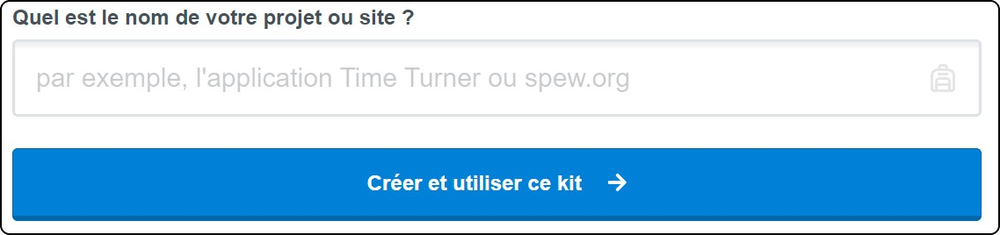
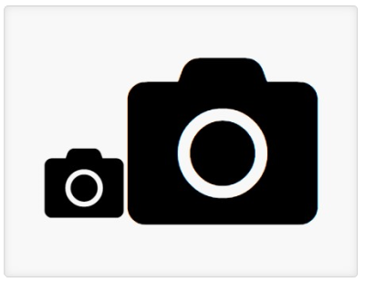
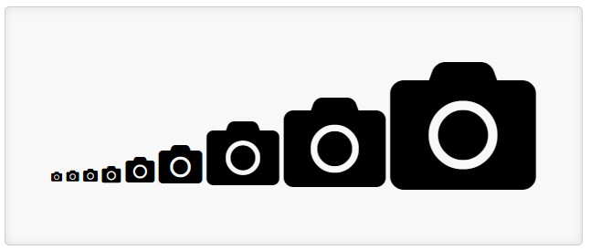
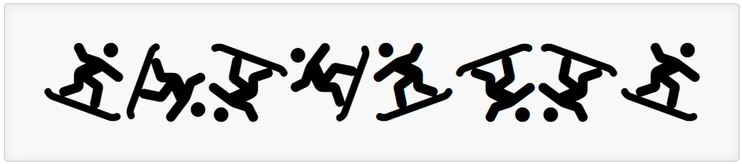
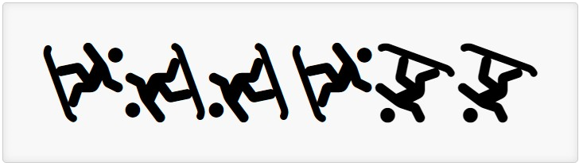
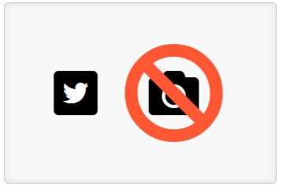

"# Tutoriel-Font-Awesome" 
# **HTML / CSS : icônes personnalisés**
## Apprendre à se servir de Font Awesome

Tawan-François Asselain - Louis Réville - Kiara Drouin


Dans ce tutoriel **HTML CSS**, nous avons pour souhait de vous introduire un outil révolutionnaire qui, si vous décidez *(à raison)* d’en faire usage pour votre site web, vous permettra notamment d’y insérer des icônes variées et personnalisables à souhait. Cet outil, c’est **Font Awesome**, qui vous permet d'implémenter aisément un icône dans votre code en plus de se révéler très facile d’accès que ce soit pour les professionnels comme pour les débutants.

## Glossaire

1) [**Présentation de Font Awesome et des icônes vectoriels**](https://github.com/LouisRvlE/Tutoriel-Font-Awesome#1-pr%C3%A9sentation-de-font-awesome-et-des-ic%C3%B4nes-vectoriels)
2) [**Intégrer Font Awesome à son fichier HTML**](https://github.com/LouisRvlE/Tutoriel-Font-Awesome#2-int%C3%A9grer-font-awesome-%C3%A0-son-fichier-html)
3) [**Implémentation d'un icône**](https://github.com/LouisRvlE/Tutoriel-Font-Awesome#3-impl%C3%A9mentation-dune-ic%C3%B4ne)
4) [**Personnalisation d'un icône**](https://github.com/LouisRvlE/Tutoriel-Font-Awesome#4-personnalisation-dun-ic%C3%B4ne)
5) [**Conclusion**](https://github.com/LouisRvlE/Tutoriel-Font-Awesome#5-conclusion)

### **Prérequis**

Pour suivre ce tutoriel, il est nécessaire d'avoir les connaissances de base en **HTML5** et en **CSS3**. Par ailleurs, le langage JavaScript ou JS sera évoqué à de multiples reprises, mais **aucune notion de JS n'est nécessaire**, et aucun fichier JS ne sera créé ou modifié.


# 1) Présentation de **Font Awesome** et des icônes vectoriels

**Font Awesome** ou *FA* est un outil accessible depuis 2012 permettant l'implémentation de divers **icônes** dans votre code HTML avec CSS *(même s'il est possible de l'utiliser avec n'importe quel logiciel faisant usage de polices, tel que Word ou n'importe quel logiciel d'édition d'images)*, et ce sous la forme justement d'une **police d'écriture**, ou bien avec des images vectorielles sous la forme d'un fichier **.svg** (Scalable Vector Graphics). Ne soyez pas intimidé par les mots compliqués, on vous expliquera tout en temps et en heure !

Font Awesome met à disposition un site web doté d'une base de données proposant aujourd'hui aux usagers une vaste gamme d'icônes, également **personnalisables** à souhait. Il existe par ailleurs un abonnement annuel permettant d'accéder à d'avantage de personnalisation. Entre nous, il semble superflu de souscrire à un tel abonnement dans le cadre d'un petit projet ou pour un site non professionnel, et si vous pensez ainsi, vous avez tout à fait raison ! Mais ne désespérez pas, développeurs indépendants et débutants en programmation, car sur son site, Font Awesome rend accessible de nombreux icônes gratuits et amplement suffisants si vous avez une idée précise de ce que vous voulez, mais pas le besoin irrémédiable d'ajuster le moindre de ses micro-pixels. Mais alors, n'est-il vraiment pas possible d'espérer apporter une petite touche personnelle à cet icône ? Spoiler alert : ça l'est, alors restez bien attentifs !

Commençons par définir ce qu'est **un icône vectoriel** *(et non je ne vous ai pas oublié)*. Un icône vectoriel, en informatique, c'est une image composée d'objets géométriques, c'est-à-dire des segments, des arcs de cercle ou encore des courbes; auxquels on peut appliquer différentes transformations, telles que des dégradés, des agrandissements, des inclinaisons ou encore des effets miroir. L'îcone vectoriel se différencie en cela des images matricielles, qui sont constituées de pixels et qui sont donc moins maléables.

Pas de panique, nous n'allons pas en créer, juste modifier ses valeurs de base, telles que sa couleur, son orientation et autre.


# 2) Intégrer Font Awesome à son fichier HTML

Il existe différentes manières d'intégrer Font Awesome à son site :

### **- Récupérer FA par Kit code**
Pour cette méthode, commençons par créer un compte **Font Awesome**. Une fois cela fait rendons nous sur la page suivante [fontawesome.com/start](https://fontawesome.com/start). Il nous sera alors demandé de fournir le nom du projet pour lequel les icônes seront amenées à servir, à noter que le nom de ce projet n'a aucune importance dans le processus d'obtention des icônes.



Enfin, nous reçevons ce que l'équipe de Font Awesome appelle un **"kit code"**, il s'agit ni plus ni moins d'un lien vers un script javascript de la forme suivante :
```HTML
<head>
    ...
    <script src="https://kit.fontawesome.com/<nom_de_votre_projet>.js" crossorigin="anonymous"></script>
</head>
```
C'est la manière la plus facile et rapide d'utiliser **Font Awesome**. C'est aussi la moins énergivore, car elle permet de n'avoir aucun surplus de fichiers sur votre machine. Cependant, cette méthode ne permet pas une utilisation hors ligne, et en cas de panne chez Font Awesome, plus aucun icône ne sera affiché sur votre site.

  L'utilisation du kit code permet en outre de régler différents paramètres, à savoir :
  - Changer le nom de son Kit.
  - Passer de la version gratuite à la version payante plus facilement.
  - Passer de l'utilisation d'une police d'écriture à l'utilisation de fichiers .svg. **(regarder cette option pour savoir comment suivre la suite du tutoriel)**
  - Rendre le kit utilisable sur votre site uniquement.
  - Changer la version de Font Awesome.
  - Activer l'accessibilité avancée.
  - Activer la retro compatibilité.
  - Détection des conflits de versions.

**Attention**, un compte gratuit ne peut être associé qu'à un seul kit, ce qui ne nous empêche pas d'utiliser malgré tout les autres méthodes.


### **- Récupérer FA depuis un lien**
Sans avoir besoin de créer un compte, il est aussi possible de faire usage des icônes directement avec un lien global **fournit** par Font Awesome.

Si vous souahitez utiliser des **polices d'écriture**, vous utiliserez le `all.css` :
```HTML
<head>
    ...
    <link rel="stylesheet" href="https://use.fontawesome.com/releases/v5.15.4/css/all.css" integrity="sha384-DyZ88mC6Up2uqS4h/KRgHuoeGwBcD4Ng9SiP4dIRy0EXTlnuz47vAwmeGwVChigm" crossorigin="anonymous">
</head>
```
Si par contre vous souhaitez utiliser des images vectorielles en **SVG**, il faudra utiliser le `all.js` :
```HTML
<head>
    ...
    <script defer src="https://use.fontawesome.com/releases/v5.15.4/js/all.js" integrity="sha384-rOA1PnstxnOBLzCLMcre8ybwbTmemjzdNlILg8O7z1lUkLXozs4DHonlDtnE7fpc" crossorigin="anonymous"></script>
</head>
```

### **- Téléchargment de FA**
Font Awesome permet également de télécharger directement ses icônes, et ce de diverses manières:
 * Télécharger le .zip directement
 Il est possible de télécharger deux versions différentes: l'une pour ordinateur, contenant des polices d'écriture et des fichiers .svg (Scalable Vector Graphics), et l'autre pour navigateur, contenant du css, du js, et ces mêmes fichiers en svg. **Pour ce tutoriel, nous utiliserons la version web.**
 [Version Ordinateur](https://use.fontawesome.com/releases/v5.15.4/fontawesome-free-5.15.4-desktop.zip) - 
 [Version Web](https://use.fontawesome.com/releases/v5.15.4/fontawesome-free-5.15.4-web.zip)
 * Installer avec npm ou yarn :
 ```sh
 npm install --save @fortawesome/fontawesome-free
 ```
 ```sh
 yarn add @fortawesome/fontawesome-free
 ```
Après avoir téléchargé un icône d'une manière ou d'une autre, il suffit d'intégrer le code dans votre head.
Là encore, il y a plusieurs manières de procéder.

Si vous souahitez utiliser des polices d'écriture, vous utiliserez le `all.css` :
```HTML
<head>
    ...
    <link href="./<chemin-vers-font-awesome>/css/all.css" rel="stylesheet">
</head>
```
Si par contre vous souhaitez utiliser des images vectorielles en **SVG**, il faudra utiliser le `all.js` :
```HTML
<head>
    ...
    <script defer src="/<chemin-vers-font-awesome>/js/all.js"></script>
</head>
```


# 3) Implémentation d'une icône

Après avoir intégré Font Awesome à votre projet, que ce soit avec un fichier `css` ou `js`, avec une **police d'écriture** ou en **SVG**, l'implémentation s'effectue toujours de la même manière :

Il nous suffit de rechercher sur le site de [Font Awesome](https://fontawesome.com/v5.15/icons?d=gallery&p=2) l'icône désirée, de nous rendre sur sa page, de copier le code HTML avant de l'intégrer au fichier à l'endroit souhaité. Et ce, que ce soit en **SVG** ou en **police d'écriture**.

Pour l'icône loupe par exemple, le code sera :
```HTML
<i class="fas fa-search"></i>
```
Et voici le résultat qui s'affiche sur votre page :


# 4) Personnalisation d'un icône

Pour personnaliser un icône, il faudra travailler sur un fichier style.css relié à notre fichier HTML. (Si vous diposez de l'abonnement Font Awesome évoqué précédemment, vous pourrez d'avantage modifier l'icône avec de nouvelles propriétés, mais nous n'évoquerons pas cela dans notre tutoriel). Sans grandes surprises, ces icônes sont éditables dans notre fichier css de la même manière que toute balise HTML.

**Attention !** IL y a une différence fondamentale entre l'utilisation d'une **police d'écriture** et du **SVG**.

Utiliser une **police d'écriture** va laisser la balise telle quelle lors de l'affichage de la page, alors que **SVG** va la remplacer automatiquement, ce qui va changer notre manière de l'éditer, car ce ne sera plus une balise `<i>` mais une balise `<svg>`.

Gardez à l'esprit que dans le cas de la **police d'écriture**, l'icône est considéré comme un élément d'une police d'écriture, et donc comme un texte, là où dans le cas du **SVG**, l'icône est considéré comme une image.

### **La taille** 
#### > La taille *en police d'écriture*
La taille de votre icône dépendra du tag CSS `font-size`, qui peut être attribué à l'icône en lui même ou à son parent, donc si le div contenant votre icône a pour `font-size: 15rem` et que votre icône est nommé de cette manière : `<i class="fas fa-camera"></i>` celui-ci adoptera cette taille.
```html
<i class="fas fa-camera"></i>
<i style="font-size: 15rem" class="fas fa-camera"></i>
```
Ce qui donne : 




Ici le code CSS est directement rentré dans la balise, mais il est toujours possible d'attribuer une class ou un ID en particulier, comme pour tout code css.


#### > La taille *en SVG*
En SVG, nos icônes ne sont plus considérés comme des éléments textuels mais comme des images, il faudra donc réadapter notre manière de coder notre fichier css.
Il n'est donc plus possible d'utiliser la propriété `font-size` pour modifier la taille de notre image. Il faudra plutôt utiliser des propriétés de tailles standard `width` et `height`.
**Attention**, il est nécéssaire que ces propriétés soient données sur une balise `<svg>` ou une class, et non pas sur la balise `<i>`, en raison de la transformaiton faite par le JavaScript évoquée précédemment.

Il est aussi important de préciser `!important` après la taille, pour que ce soit celle valeur qui soit utilisée, et non pas celle désignée par défaut par Font Awesome.
```css
svg.custom-class {
    height:50px;
    width:50px !important;
}
```
```html
<i class="fas fa-camera"></i>
<i class="fas fa-camera custom-class"></i>
```
Ce qui donne : 


Et le tour est joué !


#### > Class communes aux polices et à SVG

Il existe aussi un ensemble de class prédéfinies, permettant de changer la taille de l'icône :
```html
<!-- Extra petit -->
<i class="fas fa-camera fa-xs"></i>
<!-- Petit -->
<i class="fas fa-camera fa-sm"></i>
<!-- Normal -->
<i class="fas fa-camera"></i>
<!-- Large -->
<i class="fas fa-camera fa-lg"></i>
<!-- Fois 2 -->
<i class="fas fa-camera fa-2x"></i>
<!-- Fois 3 -->
<i class="fas fa-camera fa-3x"></i>
<!-- Fois 5 -->
<i class="fas fa-camera fa-5x"></i>
<!-- Fois 7 -->
<i class="fas fa-camera fa-7x"></i>
<!-- Fois 10 -->
<i class="fas fa-camera fa-10x"></i>
```
Affichant pour résultat :




### **La couleur**
#### > La couleur *en police d'écriture*
Pour changer la couleur de l'icône, il faudra simplement utiliser le tag CSS `color`, de cette manière :
```html
<i style="color:blue" class="fas fa-camera"></i> 
```


Ici le code CSS est directement tappé dans la balise, mais il est toujours possible d'y attribuer une class ou un ID particulier, et ce comme pour tout code CSS.


#### > La couleur *en SVG*
La procédure est la même en SVG, en revanche il n'est pas possible de préciser directement le style dans la balise comme avec une police. Il faut l'écrire dans une class ou directement pour la balise `<svg>` dans notre fichier style.
```css
svg.custom-class {
  color:blue;
}
```
```html
<i class="fas fa-camera custom-class"></i>
```


### **L'orientation**

Il est possible d'appliquer directement une rotation à un icône avec le paramètre CSS `transform: rotate(<nombre>deg)` où <nombre> est défini en degrés (il peut être positif ou négatif). Ces degrés correspondent à la rotation de l'objet.

Par ailleurs, Font Awesome nous fournit un ensemble de "class" pour effectuer la rotation d'un icône plus rapidement.
Il suffit donc d'ajouter les class `fa-rotate-*` pour faire une rotation et `fa-flip-*` pour retourner en miroir l'icône.

Comme ceci :
```html
<!-- l'original -->
<i class="fas fa-snowboarding"></i>
<!-- à 90° -->
<i class="fas fa-snowboarding fa-rotate-90"></i>
<!-- à 180° -->
<i class="fas fa-snowboarding fa-rotate-180"></i>
<!-- à 270° -->
<i class="fas fa-snowboarding fa-rotate-270"></i>
<!-- retourné à l'horizontale -->
<i class="fas fa-snowboarding fa-flip-horizontal"></i>
<!-- retourné à la verticale -->
<i class="fas fa-snowboarding fa-flip-vertical"></i>
<!-- retourné à la verticale et à l'horizontale -->
<i class="fas fa-snowboarding fa-flip-both"></i>
<!-- à 45° avec un nombre personnalisé -->
<i class="fas fa-snowboarding fa-rotate-by"
    style="--fa-rotate-angle: 45deg;"></i>
```


Le tag `fa-rotate-**by**` permet de choisir nous même l'angle de rotation, en passant par le style : `style="--fa-rotate-angle: 45deg;"`

Pour combiner les deux, il faut impérativement utiliser des marqueurs supplémentaires, par exemple un `<span>` :
```html
<!-- Un icône qui est à 90° et retourné à l'horizontale -->
  <span class="fa-rotate-90" style="display: inline-block;">
    <i class="fas fa-snowboarding fa-flip-horizontal"></i>
  </span>

  <!-- Un icône qui est retourné à l'horizontale et à 90° -->
  <span class="fa-flip-horizontal" style="display: inline-block;">
    <i class="fas fa-snowboarding fa-rotate-90"></i>
  </span>

```

```html
  <!-- Un icône qui est retourné à la verticale et à 270° -->
  <span class="fa-flip-vertical" style="display: inline-block;">
    <i class="fas fa-snowboarding fa-rotate-270"></i>
  </span>
  <!-- Un icône qui est à 270° et retourné à la verticale -->
  <span class="fa-rotate-270" style="display: inline-block;">
    <i class="fas fa-snowboarding fa-flip-vertical"></i>
  </span>

  <!-- Un icône qui est retourné à la verticale, à l'horizontale et effectue une rotation 45° -->
  <span class="fa-flip-both" style="display: inline-block;">
    <i class="fas fa-snowboarding fa-rotate-by" style="--fa-rotate-angle: 45deg;"></i>
  </span>

  <!-- Un icône qui est retourné à l'horizontale, effectue une rotation à 45° et est retourné à la verticale -->
  <span class="fa-rotate-by" style="display: inline-block; --fa-rotate-angle: 45deg;">
    <i class="fas fa-snowboarding fa-flip-both"></i>
  </span>
```




### Superposition

Font Awesome nous offre aussi la possibilité de superposer ses icônes:

Pour ce faire, il faut mettre les différents icônes à superposer dans un `<span class="fa-stack"></span>`.
Il est possible de rajouter une class `fa-<nombre>x` où <nombre> définit la taille de notre icône finale.
Pour chaque icône, il faut ajouter une class `fa-stack-<nombre>x` où <nombre> définit la taille par rapport aux autres icônes superposés. Si vous ne voulez pas changer la taille de l'icône, vous devrez tout de même préciser sa classe, avec <nombre> = 1.

Vous pouvez aussi inverser cet icône, c'est à dire que l'îcone qui lui est superposée sera retirée, afin qu'il soit visible même en étant à l'intérieur de l'autre.

Cet effet peut être reproduit en donnant simplement une autre couleur à l'icône.

```html
<span class="fa-stack fa-2x">
  <i class="fas fa-square fa-stack-2x"></i>
  <i class="fab fa-twitter fa-stack-1x fa-inverse"></i>
</span>
<span class="fa-stack fa-4x">
  <i class="fas fa-camera fa-stack-1x"></i>
  <i class="fas fa-ban fa-stack-2x" style="color:Tomato"></i>
  <!-- RAPPEL: le style ne peut être attribué de la sorte que si vous utilisez une police. L'équivalent en utilisant le SVG nécessiterait de changer d'endroit pour l'écrire. -->
</span>
```


Dans ce premier exemple :
- l'icône stack a une taille double (`fa-2x`)
- le premier icône, square, donc un carré, a une taille double (`fa-stack-2x`)
- le second icône, twitter, a une taille normale (`fa-stack-1x`) et est inversé (`fa-inverse`).

Pour le second :
- l'icône stack a une taille quadruple (`fa-4x`)
- le premier icône est une caméra, de taille simple (`fa-stack-1x`).
- le second est un "ban", de taille double (`fa-stack-2x`) et de couleur tomate (`style="color:Tomato"`)


# 5) Conclusion

Comme vous l'aurez compris, Font Awesome est un réel plus à apporter à votre site web, et cet outil mérite une attention toute particulière. Nous espérons que cet article aura facilité vos recherches, et sommes certains que les informations qu'il vous a délivré auront contribué à agrandir votre champs des possibles. Félicitations, vous êtes maintenant fin prêt à implémenter toutes sortes d'icônes dans vos projets HTML / CSS pour qu'ils vous ressemblent mieux.

Merci d'avoir lu !

